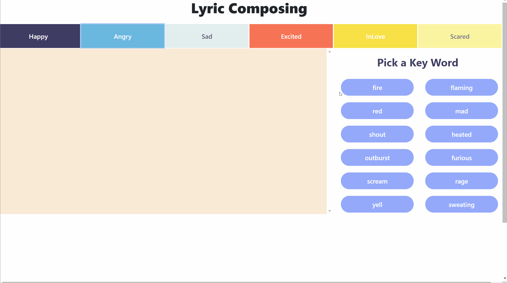

## Lyrics Generator 
Project built during the IDT Hackathon (2019).  

## Team Members 
Chaya Malik  
Ximing Chen   
Penghe Zhang   
Patrick Yin   
Ruochen You   

## Demo

GIF created with [LiceCap](http://www.cockos.com/licecap/).

## Project Description
The lyrics generator helps users write their own songs by generating lyrics based on a theme they choose.  The user first chooses one of the following themes:   
Happy   
Angry   
Sad   
Excited   
InLove   
Scared   
The user then chooses from a choice of sub themes. Once a subtheme is chosen, the user either chooses one of the four generated sentences to append to their song, or chooses a different subtheme for more options. 

## 
Note: This Software does not contain any express or implied warranties or conditions.

